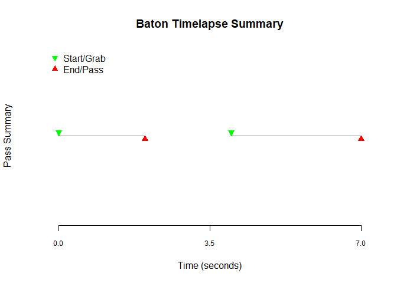

## Overview

{relay} is an R package for tracking workflows and their content. The
method invokes the idea of a relay, where a baton is created, passed,
and grabbed. The *batons* are S3 class objects with an associated YAML
file which contain metadata (internal details from system) and content
(workflow details from user). Each section of the relay ends in a
`pass_baton()`, which marks both the section as being completed
successfully and allowing user-specific details to be added as content
for tracking. A subsequent `grab_baton()` starts the process over again.
The relay can end when the baton is dropped (i.e. `drop_baton()`).
{relay} operates linearly and does support parallel/concurrent access to
*batons*.

## Details

Additional details will be provided in vignettes; however, the
information below should provide enough introduction.

### Use-cases

There are an abundance of solutions for workflow management, such as
[Apache AirFlow](https://airflow.apache.org/) and
[targets](https://github.com/ropensci/targets). {relay} does not provide
as robust a framework as these other resources but it does provide a
flexible method to track content and evaluate workflow health. Options
designed specifically for workflow logging and tracing are also
available in packages such as
[loggit](https://github.com/ryapric/loggit),
[futile.logger](https://github.com/zatonovo/futile.logger), and
[lumberjack](https://github.com/markvanderloo/lumberjack). It is
possible to use these in conjunction with, or possibly as an alternative
to, {relay}.

The original purpose of {relay} was to provide an easy method for
scheduled RMarkdown files to be tied together without having to use
entirely new tools. The rationale made sense for our group when
considering the expertise of the team and the amount of support IT could
provide. {relay} provides a way for otherwise independent scripts to
communicate through a saved *baton*. For example, using RStudio Connect
or similar resource, a set of queries that take several hours can be
scheduled throughout the day; a downstream process for processing and
report generation accesses this content. {relay} can provide a way to
evaluate the health of the query process prior to running any subsequent
step. Although in this example, the processing step could pull the
queries directly, there are benefits in having the data pre-fetched.

There are other use-cases as well; in the simplest case one can
`create_baton()` specifically to track content from a self-contained
workflow. The content could include the time the particular code, and
objects it possible created, was run and any customized information one
would want to store persistently such as the final location and time an
output was saved. Similar success can be achieved by using simple
printed text files, time-stamped files, and the like; however, {relay}
provides a framework for consistency.

### Bundling

For more complex workflows, one method is to create *bundled* content
that passes through *checkpoints*. Several helper-functions in {relay}
assist in this approach. Building from the prior example, one may start
with a folder that serves as a staging area for all of a workflows
dependent data; let us call this the *\raw* folder. A *baton* tracks
content that should exist in *\raw*. A downstream process responsible
for processing will leverage *\raw* and its *baton*, let us call this
folder *\bundle-raw*. We create this folder with a helper function
`create_bundle()`, or manually if preferred, perhaps containing a new
sub-folder called *.\processed* and another called *.\raw* which is a
copy of content from the original *\raw*. The *baton* associated with
the data queries can be grabbed for inspection. Based upon the metadata
and content of the *baton*, the processing step may halt or proceed, the
conditions of success are up to you. However, if the *baton* was never
*passed*, the metadata in the YAML file will have a key-value of
`passed: no`. This should be a clear indication that something went
terribly wrong in the prior steps. Assuming the processing steps can
start, the bundle will be updated with new content and the *baton*
passed again with any new content for tracking. If this is the final
step in the relay, the baton can be dropped and moved into the bundle as
a quick way to inspect health of the content and how it was processed.
The content included is up to the user!

There are some benefits in bundling data, code, and metadata in a single
location. For one, it allows the entire piece to be zipped and shared as
a reproducible environment. Typically, common practice dictates that a
fresh query is preferable to data copies. However, sometimes there is
preference for static copies so exact reports can be regenerated with
minor tweaks in a reproducible way. This is usually easy when the number
of data sources is small and on a similar schedule; it becomes
exceedingly complex when there are 10+ data sources, custom look-up
tables, which all get updated at different times. At this point,
bundling all the content in one place may be easier. There are many
alternatives to this, which will often be better suited. Regardless,
{relay} can still be helpful whether or not bundles are being used as it
really is just a method to track content.

### Interoperability

A benefit for {relay} is that is links to a YAML file and not just R
objects. This means any software that can parse YAML files could use
this information created from the R workflow. One can then conceive of
workflows that may start in `R` and then inspected by and continued in
`python`.

## Installation

{relay} is hosted on github only at this time.

``` r
# Install
remotes::install_github('al-obrien/relay')
```

## Minimal example

### First Process

Create the baton, and after the workflow process, the baton_content will
check to see if specific datasets are present and the time they were
created when the baton was in the relay.

``` r
# Load
library(relay)
library(purrr)

# Create initial baton in workflow
work_loc <- '/my/fav/loc'
my_baton <- create_baton(loc = work_loc)

# Workflow...
# .
# ..
# ...

# Create content for baton to carry
data_manifest <- c('dataset1.sas7bdat', 'dataset2.csv', 'lookup1.xlsx')
baton_content <-  list(datasets = list(names = data_manifest,
                                      existence = map_lgl(data_manifest, ~file.exists(paste0(work_loc, '/', .))),
                                      creation_times = map_chr(data_manifest,
                                                               ~as.character(file.info(paste0(work_loc, '/', .))$ctime))))

# Pass content to baton at end of script
my_baton <- pass_baton(my_baton, content = baton_content)
```

### Second process

Grab the baton from the initial process, and perform a checkpoint before
proceeding. Batons are created with a specific convention by default so
they should be easy to find by a pattern. For the most recent baton, a
filter by creation date can be done. However, since the first section of
the name includes their time-stamp, the earliest one should be first in
the list. The checks performed can be performed within `tryCatch()` to
determine specific types of output to be generated if the check fails.

``` r
# Grab baton
work_loc <- '/my/fav/loc'
my_baton <- grab_baton(loc = file.path(work_loc, locate_batons(work_loc)[1])

                            
# Perform checks to determine what following steps are performed
stopifnot(all(my_baton$content$datasets$existence),
            my_baton$metadata$passes_completed == 1, 
            all(my_baton$content$datasets$creation_times > Sys.Date()-1))

# Workflow continues...
# .
# ..
# ...  
```

## Plot a timelapse of the baton

``` r
plot(my_baton)
```



## Locate batons

As a workflow grows, it may become more difficult to find where they are
in the R environment or on the file system. It is recommended to use
`locate_batons()` for this purpose. This also allows the user to define
which **relay_type** to search for. This could be important if you have
a mix of testing batons mixed in with ones being actively used.

``` r
# Location on file system that has baton objects saved
work_loc <- '/my/fav/loc'

# Get list from location of interest, exclude all test batons
baton_2_load <- locate_batons(work_loc, relay_type = 'COMPETITION')

# Examine information, slice top
baton_2_load_info <- file.info(baton_2_load)
baton_2_load <- baton_2_load[1]

# Load the baton of interest
my_baton <- grab_baton(loc = baton_2_load)
```

## Examine baton

There are several helper functions to make it easier to examine contents
of a baton, either within the R session or through the connection to the
persistent YAML file.

``` r
# Within R session
read_metadata(my_baton, subset = c('pass_complete', 'relay_type', 'relay_start', 'relay_finish'))

# If from YAML
read_metadata(loc = 'path/to/baton.yml')
```

    ## $pass_complete
    ## [1] TRUE
    ## 
    ## $relay_type
    ## [1] "COMPETITION"
    ## 
    ## $relay_start
    ## [1] "2023-04-28 15-13-26"
    ## 
    ## $relay_finish
    ## [1] "2023-04-28 15-13-33"

For functions such as `summary` and `plot`, one may not want to load the
baton directly. However, since these functions require a specific class
to operate, one can not simply just read the YAML file. Instead, we can
use the `preview_baton()` constructor and pass this to the appropriate
generics.

``` r
plot(preview_baton('path/to/baton.yml'))
summary(preview_baton('path/to/baton.yml'))
```
